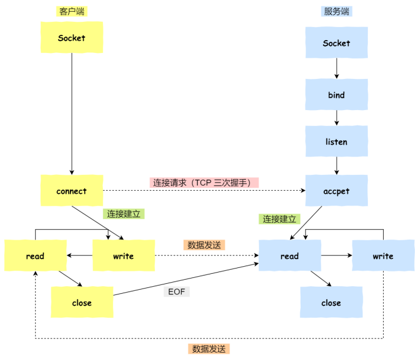

# 套接字编程——TCP、UDP、本地通信

[TOC]

## 1. 系统调用

- [*socket*](./syscalls/syscalls-socket.md)：套接字命名

- [*bind*](./syscalls/syscalls-bind.md)：套接字绑定本地地址

- [*listen*](./syscalls/syscalls-listen.md)：监听套接字上的连接请求

- [*accept*](./syscalls/syscalls-accept.md)：接收套接字连接请求

- [*connect*](./syscalls/syscalls-connect.md)：尝试创建连接（TCP）或指定数据报目的地和来源（UDP）

- [*close*](./syscalls/syscalls-close.md)：关闭套接字（发送“EOF”)

- [*read*](./syscalls/syscalls-read.md)：从套接字中读取字节流

- [*write*](./syscalls/syscalls-write.md)：将字节流写入套接字

- [*recv*](./syscalls/syscalls-recv.md)：

  从套接字中接收消息

  - *recv*、*recvmsg*、*recvfrom*

- [*send*](./syscalls/syscalls-send.md)：

- [*inet*](./syscalls/syscalls-inet.md)：

  - *inet_aton* ：将 IPv4 点分十进制地址字符串转换为32位二进制网络字节序数值
  - *inet_ntoa*：将32位二进制网络字节序地址值转换为 IPv4 点分十进制地址字符串
  - ...

- [*htonl*](./syscalls/syscalls-htonl.md)：

  将32位或16位数在网络字节序和主机字节序之间转换

  - *htonl*、*htons*、*ntohl*、*ntohs*

- [*atof*](./syscalls/syscalls-atof.md)：

  将表示数字的字符串转换为数值返回

  - *atof*、*atoi*、*atol*、*atoll*
  - *strtod*、*strtof*、*strtold*
  - *strtol*、*strtoll*、*strtoul*、*strtoull*

- [*perror*](./syscalls/syscalls-perror.md)


## 2. 描述网络地址的数据类型

```c
/* 网络地址 <in.h> */
typedef uint32_t in_addr_t;
struct in_addr {
    in_addr_t s_addr;
};

/* 网络套接字地址 <in.h> */
struct sockaddr_in {
    sa_family_t sin_family;    /* 协议家族 */
    in_port_t sin_port;        /* 端口号，网络字节序 */
    struct in_addr sin_addr;   /* 网络地址 */
    unsigned char sin_zero[    /* 填充空位以和'struct sockaddr'等长  */
        sizeof (struct sockaddr)
    -   sizeof (sin_family)
    -   sizeof (in_port_t)
    -   sizeof (struct in_addr)
    ];
};

/* 套接字地址 <socket.h> */
struct sockaddr {
    sa_family_t sa_family;  /* 协议家族 */
    char sa_data[14];       /* 地址数据 */
};
```


## 3. 基本编程模式

### 3.1.TCP

> 1. 服务端和客户端分别初始化 **socket**，得到【套接字文件描述符】
> 2. 服务端调用 **bind** ，绑定【服务端IP】和【服务端端口号】
> 3. 服务端调用 **listen**，开始监听
> 4. 服务端调用 **accept** ，等待客户端连接，进程阻塞等待
> 5. 客户端调用 **connect** ，向【服务端IP:端口号】发起连接请求
> 6. 三次握手后服务端，服务端进程被唤醒，**accept** 返回【套接字文件描述符】
>    - 三次握手后返回的套接字用于传输，初始化的套接字用于监听，二者不是同一个文件
> 7. 客户端调用**write**写数据，服务端调用**read**读数据
> 8. 客户端调用**close**发送**EOF**，服务端读到**EOF**待数据处理完后调用**close**关闭连接




### 3.2. UDP

...

### 3.3. 本地通信

...

## 4. 用于网络连接诊断的常用指令

### 4.1. TCP

- netstat -nat | grep <端口号>

  > 查看端口号对应的tcp连接状态
  >
  > 

- tcpdump -iany tcp port <端口号>

  > 对端口号的tcp连接进行抓包
  >
  > 

- lsof -i:<端口号>

  > 查看端口号的TCP连接
  >
  > 
